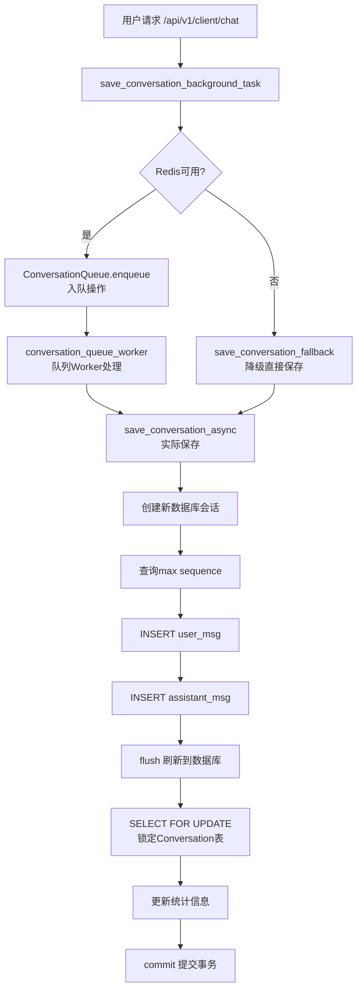

# 会话保存死锁问题自查报告

## 一、问题概述

### 1.1 错误信息

```
2026-01-15 17:30:53.381 | ERROR | services.conversation:save_conversation_async:584 
- 保存对话失败(尝试 5/5): 错误码=1205
(pymysql.err.OperationalError) (1205, 'Lock wait timeout exceeded; try restarting transaction')

[SQL: INSERT INTO conversation_messages 
(conversation_id, `role`, content, tokens, sequence, embedding_status, created_at, updated_at) 
VALUES (%s, %s, %s, %s, %s, %s, now(), now())]

[parameters: (30, 'user', '给我3个选题', 1, 1, 'pending')]

2026-01-15 17:31:12.572 | ERROR | utils.exceptions:global_exception_handler:230 
- Unhandled Exception: OperationalError: 
(pymysql.err.OperationalError) (2013, 'Lost connection to MySQL server during query')
```

### 1.2 问题特征

- **错误码 1205**: `Lock wait timeout exceeded` - 锁等待超时（默认50秒）
- **错误码 2013**: `Lost connection to MySQL server` - 连接在查询期间断开
- **发生位置**: `services/conversation.py:save_conversation_async` 第584行
- **操作类型**: INSERT 操作，向 `conversation_messages` 表插入数据
- **会话ID**: 30（多次尝试保存同一会话的消息）
- **重试次数**: 已尝试5次，全部失败

---

## 二、代码流程分析

### 2.1 保存流程调用链



### 2.2 关键代码位置

#### 2.2.1 后台任务入口

**文件**: `backend/routers/client/creation.py:67-130`

```python
async def save_conversation_background_task(...):
    # 优先使用队列
    success = await ConversationQueue.enqueue(...)
    
    if not success:
        # Redis不可用时，降级为直接保存
        await save_conversation_fallback(...)
```

**分析**:
- 优先使用Redis队列，避免并发冲突
- **风险点**: Redis不可用时，会降级到直接保存模式，仍然会有锁冲突

#### 2.2.2 降级保存函数

**文件**: `backend/routers/client/creation.py:133-193`

```python
async def save_conversation_fallback(...):
    async with async_session_maker() as db:
        service = ConversationService(db)
        # 直接调用保存，无队列保护
        await service.save_conversation_async(...)
```

**分析**:
- 降级模式下，多个请求可能同时调用 `save_conversation_async`
- 没有队列序列化保护，容易出现并发冲突

#### 2.2.3 核心保存方法

**文件**: `backend/services/conversation.py:466-594`

```python
async def save_conversation_async(...):
    for attempt in range(max_retries):  # 最多重试5次
        try:
            async with async_session_maker() as db:
                # 1. 查询最大sequence（无锁）
                max_sequence = await db.execute(
                    select(func.max(ConversationMessage.sequence))
                    .where(ConversationMessage.conversation_id == conversation_id)
                )
                
                # 2. 创建消息对象
                user_msg = ConversationMessage(
                    conversation_id=conversation_id,
                    sequence=max_sequence + 1,
                    ...
                )
                assistant_msg = ConversationMessage(
                    conversation_id=conversation_id,
                    sequence=max_sequence + 2,
                    ...
                )
                
                # 3. 插入消息（会产生间隙锁）
                db.add(user_msg)
                db.add(assistant_msg)
                await db.flush()  # ⚠️ 这里会产生间隙锁
                
                # 4. 锁定Conversation表更新统计
                conversation = await db.execute(
                    select(Conversation)
                    .where(Conversation.id == conversation_id)
                    .with_for_update(skip_locked=True)  # ⚠️ 只对SELECT有效
                )
                
                # 5. 更新统计
                conversation.message_count += 2
                conversation.total_tokens += user_tokens + assistant_tokens
                
                await db.commit()
                
        except OperationalError as e:
            if error_code in (1205, 1213):
                # 重试...
```

**分析**:
- **每次重试都创建新的数据库会话**，但操作仍在一个事务内
- **INSERT操作会产生间隙锁**：MySQL在插入时会锁定索引间隙，多个并发插入会产生锁竞争
- **`skip_locked=True` 只对 SELECT FOR UPDATE 有效**，对 INSERT 操作无效
- **sequence计算存在竞态条件**：高并发下多个请求可能读到相同的 `max_sequence`，导致插入相同的sequence值

---

## 三、死锁根本原因分析

### 3.1 MySQL间隙锁机制

**问题**: MySQL在 `REPEATABLE READ` 隔离级别下，INSERT操作会产生**间隙锁(Gap Lock)**

**场景示例**:
```
时间线:
T1: 请求A 查询 max_sequence = 5
T2: 请求B 查询 max_sequence = 5  (并发查询，读到相同值)
T3: 请求A INSERT sequence = 6 (获得间隙锁)
T4: 请求B INSERT sequence = 6 (等待A的间隙锁) ⚠️ 锁等待
T5: 请求A 需要锁定Conversation表更新统计
T6: 请求A 等待其他事务释放Conversation锁
T7: 请求B 继续等待A的间隙锁释放
```

**结果**: 
- 如果Conversation表被其他事务锁定，请求A会等待
- 请求B等待请求A释放间隙锁
- 形成**循环等待**，最终导致锁超时（1205错误）

### 3.2 序列号计算竞态条件

**问题**: `max(sequence)` 查询和 INSERT 之间不是原子操作

**代码位置**: `backend/services/conversation.py:501-505`

```python
# 查询最大sequence（无锁）
max_sequence_query = select(func.max(ConversationMessage.sequence)).where(...)
max_sequence_result = await db.execute(max_sequence_query)
max_sequence = max_sequence_result.scalar() or 0

# 假设此时 max_sequence = 5

# 创建消息对象（sequence = 6, 7）
user_msg = ConversationMessage(sequence=max_sequence + 1)  # sequence = 6
assistant_msg = ConversationMessage(sequence=max_sequence + 2)  # sequence = 7

# ⚠️ 问题：如果另一个事务在这期间已经插入了 sequence = 6
# 那么当前事务的 INSERT 会失败（如果有唯一索引）或产生锁等待
```

**并发场景**:
```
事务A: 查询 max_sequence = 5 → 准备插入 sequence = 6, 7
事务B: 查询 max_sequence = 5 → 准备插入 sequence = 6, 7  (并发)
事务B: 先 INSERT sequence = 6 (获得锁)
事务A: 尝试 INSERT sequence = 6 (等待事务B释放锁)
```

### 3.3 Conversation表更新锁竞争

**问题**: 更新Conversation统计信息时使用 `with_for_update(skip_locked=True)`，但如果锁被占用，会触发重试

**代码位置**: `backend/services/conversation.py:535-550`

```python
# 使用 skip_locked 避免锁等待
conversation_query = select(Conversation).where(
    Conversation.id == conversation_id
).with_for_update(skip_locked=True)

conversation = conversation_result.scalar_one_or_none()

# 如果因为锁冲突没获取到记录，触发重试
if conversation is None:
    raise OperationalError(...)
```

**问题分析**:
- `skip_locked=True` 确实可以避免长时间等待
- 但会触发重试，如果重试期间仍有其他事务占用锁，会一直重试
- **最多重试5次**，如果5次都失败，最终会抛出异常

### 3.4 事务时间过长

**问题**: 整个保存过程在一个事务内完成，包括：
1. 查询max sequence
2. INSERT两条消息
3. flush到数据库
4. 锁定Conversation表
5. 更新统计信息
6. commit

**时间线**:
```
T0: 开始事务
T1: 查询max_sequence (1ms)
T2: 创建消息对象 (1ms)
T3: INSERT消息到内存 (1ms)
T4: flush到数据库 (可能产生间隙锁，等待其他事务) ⚠️ 如果这里有锁等待，整个事务时间变长
T5: 锁定Conversation表 (可能等待) ⚠️
T6: 更新统计 (1ms)
T7: commit (等待所有锁释放) ⚠️
```

**如果T4或T5发生锁等待**，整个事务会持有连接和锁，直到超时（120秒）

### 3.5 队列机制失效场景

**场景1: Redis不可用**
```
用户请求 → save_conversation_background_task
         → ConversationQueue.enqueue() 返回 False
         → save_conversation_fallback() 降级直接保存
         → 多个请求同时调用 save_conversation_async ⚠️ 并发冲突
```

**场景2: 队列Worker并发处理同一会话**
```
虽然有3个Worker，但都是并行处理
如果多个任务都是同一个conversation_id，仍然会并发冲突
```

**场景3: 降级模式下的重试**
```
save_conversation_fallback → save_conversation_async
                           → 重试5次，每次重试都创建新会话
                           → 如果外部仍有其他请求，会持续冲突
```

---

## 四、问题定位总结

### 4.1 直接原因

1. **INSERT操作产生间隙锁**：多个并发请求向同一个 `conversation_id` 插入消息时，会产生间隙锁竞争
2. **sequence计算非原子**：`max(sequence)` 查询和 INSERT 之间不是原子操作，存在竞态条件
3. **事务时间过长**：整个保存过程在一个事务内，锁等待会延长事务时间
4. **队列机制可能失效**：Redis不可用时降级为直接保存，失去队列保护

### 4.2 深层原因

1. **数据库隔离级别**：`REPEATABLE READ` 隔离级别会产生间隙锁
2. **缺乏分布式锁**：虽然有Redis队列，但没有按 `conversation_id` 分片的分布式锁
3. **重试机制加剧冲突**：重试时创建新会话，如果外部仍有并发请求，会持续冲突
4. **降级方案不完善**：降级到直接保存时，没有额外的锁保护机制

### 4.3 触发条件

1. **高并发场景**：多个用户同时向同一个会话发送消息
2. **Redis不可用**：队列机制失效，降级到直接保存
3. **长时间持有锁**：其他事务长时间持有 `Conversation` 表或消息表的锁
4. **数据库性能问题**：查询或插入性能慢，延长事务时间

---

## 五、潜在影响

### 5.1 用户体验影响

- **请求超时**：锁等待超时导致请求失败，用户体验差
- **数据丢失风险**：如果重试5次都失败，消息可能不会保存
- **服务不稳定**：频繁的锁超时可能导致服务不可用

### 5.2 系统稳定性影响

- **数据库连接耗尽**：长时间等待锁会占用数据库连接，可能导致连接池耗尽
- **级联故障**：一个会话的锁超时可能影响其他会话的正常保存
- **资源浪费**：重试机制会消耗大量数据库资源

---

## 六、解决方案建议（不修改代码，仅建议）

### 6.1 短期优化（不修改代码逻辑）

1. **检查Redis连接状态**
   - 确保Redis正常运行，避免降级到直接保存模式
   - 监控Redis连接健康状态

2. **数据库优化**
   - 检查 `lock_wait_timeout` 配置（当前120秒）
   - 优化数据库索引，减少锁范围
   - 检查是否有长时间运行的事务

3. **监控和告警**
   - 监控锁等待时间
   - 监控队列大小和Worker状态
   - 设置告警，及时发现Redis不可用情况

### 6.2 中期优化（需修改代码）

1. **按conversation_id分片的分布式锁**
   - 在Redis中为每个 `conversation_id` 设置分布式锁
   - 确保同一会话的保存操作串行执行

2. **优化sequence生成方式**
   - 使用数据库自增ID或序列号生成器
   - 或者使用 `SELECT ... FOR UPDATE` 锁定后计算sequence

3. **拆分事务**
   - 将消息插入和统计更新分为两个事务
   - 减少单个事务持有锁的时间

4. **改进重试策略**
   - 增加重试延迟时间（指数退避）
   - 限制最大重试次数，避免无限重试

### 6.3 长期优化

1. **使用乐观锁**
   - 使用版本号机制，避免悲观锁
   - 冲突时重试，降低锁竞争

2. **异步批量处理**
   - 将消息保存改为批量处理
   - 减少数据库交互次数

3. **使用消息队列（RabbitMQ/Kafka）**
   - 替换Redis List，使用更可靠的消息队列
   - 支持消息确认机制，避免消息丢失

---

## 七、排查建议

### 7.1 立即检查项

1. **检查Redis状态**
   ```bash
   redis-cli ping
   redis-cli LLEN conversation:save:queue
   ```

2. **检查数据库锁状态**
   ```sql
   -- 查看当前锁等待情况
   SELECT * FROM information_schema.innodb_locks;
   SELECT * FROM information_schema.innodb_lock_waits;
   
   -- 查看长时间运行的事务
   SELECT * FROM information_schema.innodb_trx 
   WHERE trx_started < DATE_SUB(NOW(), INTERVAL 10 SECOND);
   ```

3. **检查日志**
   - 查看是否有 "Redis不可用" 的警告日志
   - 查看队列Worker是否正常运行
   - 查看是否有其他长时间运行的事务

### 7.2 监控指标

1. **队列监控**
   - 队列大小是否持续增长
   - Worker处理速度是否正常
   - 是否有任务重试失败

2. **数据库监控**
   - 锁等待时间
   - 事务执行时间
   - 连接池使用率

3. **应用监控**
   - 保存失败率
   - 平均响应时间
   - Redis连接状态

---

## 八、结论

### 8.1 问题本质

**会话保存死锁问题的根本原因**是：

1. **INSERT操作产生间隙锁**，多个并发请求向同一会话插入消息时会产生锁竞争
2. **序列号计算存在竞态条件**，`max(sequence)` 查询和 INSERT 不是原子操作
3. **事务时间过长**，锁等待会延长事务持有时间
4. **队列机制可能失效**，Redis不可用时降级为直接保存，失去队列保护

### 8.2 当前措施的有效性

- ✅ **队列机制有效**：Redis可用时，可以避免大部分并发冲突
- ⚠️ **降级方案有风险**：Redis不可用时，仍会出现锁冲突
- ⚠️ **重试机制不足**：重试5次后仍失败，缺乏最终保障
- ⚠️ **锁策略不完善**：`skip_locked=True` 只对 SELECT FOR UPDATE 有效，对 INSERT 无效

### 8.3 建议优先级

1. **P0（立即）**: 确保Redis正常运行，避免降级模式
2. **P1（短期）**: 添加按 `conversation_id` 分片的分布式锁
3. **P2（中期）**: 优化sequence生成方式，使用原子操作
4. **P3（长期）**: 考虑使用乐观锁或消息队列方案

---

**报告生成时间**: 2026-01-15  
**分析代码版本**: 当前代码库  
**相关文档**: [LOCK_OPTIMIZATION_GUIDE.md](LOCK_OPTIMIZATION_GUIDE.md)


