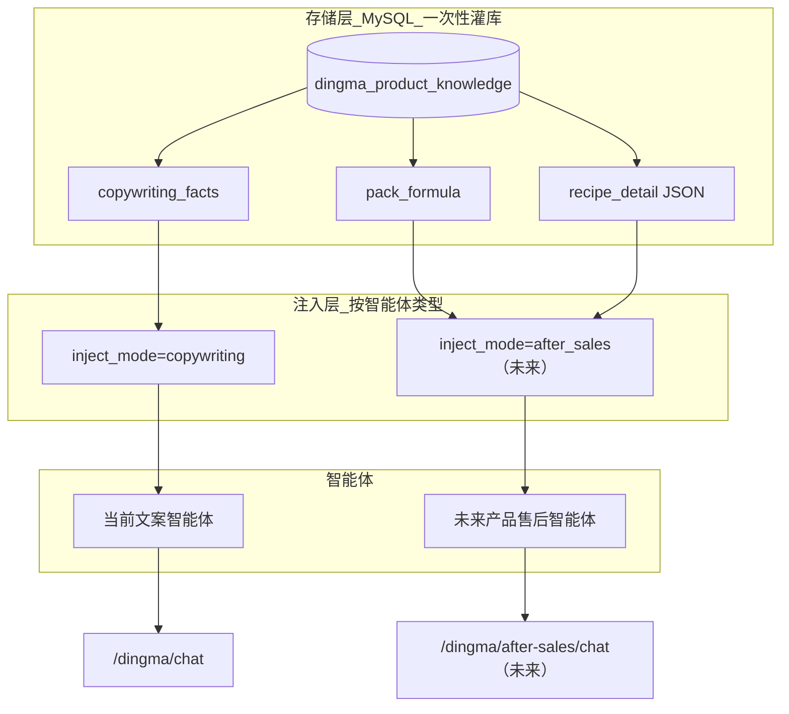
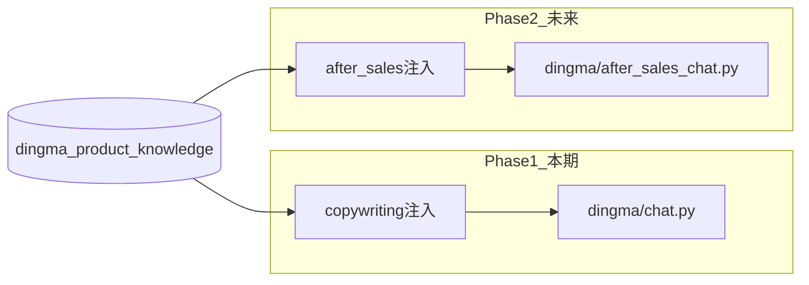

# 顶妈知识库方案（修订版 v3）

## 核心原则：**存全量、用分层、扩智能体**

| 层级 | 做什么 | 本期是否使用 |
|------|--------|-------------|
| **存储层** | PDF 配方全量入库（出货配比、克重、步骤、母馅等） | 是，一次性 seed |
| **注入层（文案）** | 当前智能体只注入 `copywriting_facts`（含/不含/可写/不可写，无克重） | 是 |
| **注入层（售后）** | 未来售后智能体注入 `pack_formula` + `recipe_detail` | 否，预留接口 |

一句话：**配方该保存保存，文案先用轻的；售后智能体以后接上，不用重新导入。**

---

## 可行性结论

**可行。** 存储与使用解耦后，既满足「后期扩展不重导」，又保持当前文案链路轻量、主程序隔离不变。



---

## 数据模型（单表，全量存储 + 文案轻量字段）

表名：`dingma_product_knowledge`

### 基础标识

| 字段 | 类型 | 说明 |
|------|------|------|
| `tenant_id` | BIGINT | dingma 租户 |
| `category_code` | VARCHAR(32) | `mixian`, `wonton`… 便于筛选 |
| `category_name` | VARCHAR(64) | 米线、馄饨 |
| `product_code` | VARCHAR(64) | 稳定编码，唯一 |
| `product_name` | VARCHAR(128) | 泡菜朝鲜面 |
| `aliases` | JSON | `["朝鲜面","泡菜面"]` |
| `status` / `sort_order` | | 启用与排序 |

### 存储字段（全量入库，本期文案不用）

| 字段 | 类型 | 内容来源（PDF） | 用途 |
|------|------|----------------|------|
| `pack_formula` | TEXT | 第2页出货配比表（含克重/包数） | 未来售后、学员制作问答 |
| `recipe_detail` | JSON | 第3~37页制作步骤、母馅、酱料配方 | 未来售后智能体详细回答 |
| `source_version` | VARCHAR(32) | `2026-01` | 课件版本追溯 |

`recipe_detail` JSON 结构建议（seed 时写入，不要求首期代码解析）：

```json
{
  "ingredients": [{"name": "包菜", "amount": "1500g"}, ...],
  "steps": ["包菜去皮切丝（不洗）", ...],
  "notes": ["有生水易坏", "选加香菜"],
  "base_recipe_ref": "layou"
}
```

### 文案字段（本期注入用）

| 字段 | 类型 | 说明 |
|------|------|------|
| `copywriting_facts` | TEXT | 文案防编造专用，无克重 |

`copywriting_facts` 示例：

```
【泡菜朝鲜面】
含：朝鲜面、泡菜、粉料调味、虾皮紫菜、辣油、小酥豆
不含：肉类、海鲜、药膳成分
可写：私房早餐、配料丰富、酸辣开胃
不可写：治疗、药用、未列出的食材或功效
```

**seed 时同时生成**：从 `pack_formula` 提炼「含/不含」→ 写入 `copywriting_facts`；`pack_formula` 与 `recipe_detail` 保留 PDF 原文精度。

---

## 注入模式（KnowledgeService 核心扩展点）

[`services/dingma/knowledge.py`](backend/services/dingma/knowledge.py)：

```python
class KnowledgeInjectMode:
    COPYWRITING = "copywriting"   # 默认：仅 copywriting_facts
    AFTER_SALES = "after_sales"   # 未来：pack_formula + recipe_detail 格式化
```

| 模式 | 注入内容 | 适用智能体 |
|------|---------|-----------|
| `copywriting` | `copywriting_facts`（+ 铁律 + 未命中产品索引） | **当前全部 dingma 文案智能体** |
| `after_sales` | `pack_formula` + `recipe_detail` 摘要（含克重步骤） | **未来产品售后智能体** |

**本期** [`dingma/chat.py`](backend/routers/client/dingma/chat.py) 硬编码或默认 `inject_mode=copywriting`。

**未来** 新增 `dingma/after_sales_chat.py` 或 Agent `config.knowledge_inject_mode=after_sales`，**读同一张表**，无需重导配方。

---

## 当前智能体定位（你已确认）

- **本期**：文案生成（朋友圈、种草、新品预热等），不做产品详细售后
- **约束**：不讲配方没有的东西（靠 `copywriting_facts` + rule 铁律）
- **不要求**：文案中出现精确克重
- **未来**：若某产品售后效果好，单独做「产品售后智能体」→ 切换 `after_sales` 注入模式即可

---

## 架构与隔离（不变）

- 主程序 [`creation.py`](backend/routers/client/creation.py)：**零改动**
- dingma 专用：`backend/routers/client/dingma/` + `backend/services/dingma/`
- 新接口：`POST /api/v1/client/dingma/chat`
- 小程序：[`generate.ts`](dingma/src/api/generate.ts) 仅改 URL



---

## 一次性全量灌库

数据文件：[`backend/data/dingma/product_knowledge_2026.json`](backend/data/dingma/product_knowledge_2026.json)

每条记录包含**全部字段**：

```json
{
  "product_code": "mixian_paocai_chaoxian",
  "category_code": "mixian",
  "category_name": "米线",
  "product_name": "泡菜朝鲜面",
  "aliases": ["朝鲜面", "泡菜面"],
  "pack_formula": "面块1包（朝鲜面） 泡菜1包50g 粉料1包（盐5g，鸡粉5g，糖10g）...",
  "recipe_detail": { "ingredients": [...], "steps": [...], "notes": [...] },
  "copywriting_facts": "含：...\n不含：...\n可写：...\n不可写：...",
  "source_version": "2026-01"
}
```

脚本：[`backend/scripts/seed_dingma_product_knowledge.py`](backend/scripts/seed_dingma_product_knowledge.py)
- 幂等 upsert（按 `product_code`）
- 全量覆盖 PDF 所有 SKU + 关联子配方（辣油、泡菜、母馅等可作为独立 `product_code` 或嵌在 `recipe_detail`）

入库范围：
- **全部录入**：米线11款、馄饨/饺子/包子/饭团/披萨/香肠/烧麦/面点/泡菜等 + 子配方
- **文案只用** `copywriting_facts`；其余字段沉睡，等售后智能体唤醒

---

## 产品识别（不选品，不变）

1. 用户输入 → `product_name` / `aliases` 子串匹配 → Top 1~3
2. 按 `inject_mode` 取对应字段组装 Prompt
3. 未命中 → 产品名索引 + 引导补充产品名

---

## 目录结构

```
backend/
├── routers/client/dingma/
│   ├── __init__.py
│   └── chat.py                    # 本期：文案 + copywriting 注入
│   # after_sales_chat.py          # 未来：售后专用
├── services/dingma/
│   ├── knowledge.py               # 匹配 + inject_mode 分发
│   └── constants.py               # 铁律模板、InjectMode 枚举
├── models/dingma_product_knowledge.py
├── data/dingma/product_knowledge_2026.json
└── scripts/seed_dingma_product_knowledge.py
```

---

## 技能包（文案智能体）

- `rule` 铁律：只许用【产品事实】，禁止编造未列成分/功效
- `model` 技能：营销写法（与知识库解耦）
- `is_routing_enabled=0`

售后智能体未来可另配 `rule`：「可引用克重与步骤，但仍不得编造未列出信息」。

---

## 实施分期

### Phase 1（本期，约 4~5 人天）

- 全量字段表 + Migration
- PDF → 全量 JSON（含 pack_formula、recipe_detail、copywriting_facts）
- seed 灌库
- `knowledge.py`（`copywriting` 模式）
- `dingma/chat.py` + 路由 + 小程序改 URL
- 文案智能体 rule 技能 + 联调

### Phase 2（按需）

- 后台 CRUD（`routers/admin/dingma/`，可编辑全字段）
- **产品售后智能体** + `after_sales` 注入模式 + 独立 chat 路由
- 可选：生成后 audit

### 明确不做（本期）

- 修改主程序 `creation.py`
- 文案智能体注入克重/制作步骤
- 小程序选品 UI
- 向量 RAG

---

## 风险

| 风险 | 缓解 |
|------|------|
| 全量 JSON 编制工作量大 | 先米线+馄饨高频品类上线，其余品类同结构批量补全 |
| 存储与文案字段不一致 | seed 脚本从 pack_formula 自动生成 copywriting_facts，人工校对 |
| 售后模式 token 过大 | after_sales 模式再做分段注入（成品配比 vs 制作详情） |
| chat 逻辑 fork 漂移 | 注释标明 fork 日期；售后路由独立文件 |

---

## 最终建议

你的判断是对的：**配方全量入库一次，当前文案只用轻字段，售后智能体以后切换注入模式**——这是「最小改动 + 最长扩展性」的平衡点。

- **存储**：不缩水，PDF 能灌的都灌
- **使用**：文案智能体只读 `copywriting_facts`
- **扩展**：售后智能体 `inject_mode=after_sales`，**同表同库，零重导**

确认后实施顺序：**Migration（全字段）→ 全量 JSON+Seed → knowledge.py（copywriting 模式）→ dingma/chat.py → 路由+小程序 → rule 技能 → 联调**。
