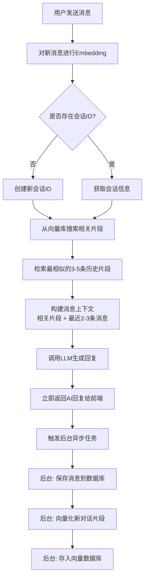
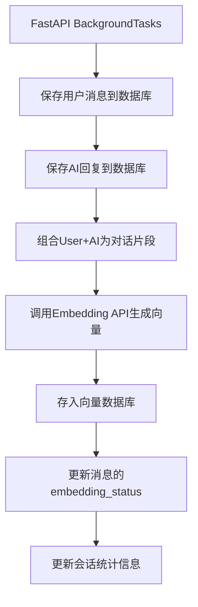

# 对话历史存储与回溯系统实现方案（向量检索版）

## 核心功能

1. **数据库存储**：每次对话自动保存到数据库（会话表 + 消息表）
2. **向量化存储**：每轮对话（User + AI）进行Embedding，存入向量数据库
3. **语义搜索**：新消息时，从向量库搜索最相关的3-5条历史片段，仅将这些片段放入Context
4. **历史回溯**：支持查看和管理历史会话，可以重新打开继续对话
5. **异步处理**：前台快速响应，后台异步处理存储和向量化（不阻塞用户）
6. **Token优化**：Token消耗恒定（只发送相关片段），具备长期记忆能力

## 数据库设计

### 1. 会话表（conversations）

- `id`: 主键
- `user_id`: 用户ID（外键）
- `agent_id`: 智能体ID（外键，可选）
- `project_id`: 项目ID（外键，可选）
- `title`: 会话标题（自动生成，首条用户消息摘要）
- `model_type`: 使用的模型类型
- `total_tokens`: 总token数（用于统计）
- `message_count`: 消息数量
- `status`: 状态（active=活跃, archived=归档）
- `created_at`, `updated_at`: 时间戳

### 2. 消息表（conversation_messages）

- `id`: 主键
- `conversation_id`: 会话ID（外键）
- `role`: 角色（user/assistant/system）
- `content`: 消息内容（Text类型）
- `tokens`: 该消息的token数（用于统计）
- `sequence`: 消息序号（用于排序）
- `embedding_status`: 向量化状态（pending=待处理, processing=处理中, completed=已完成, failed=失败）
- `created_at`: 创建时间

### 3. 对话片段表（conversation_chunks，可选，用于存储完整的User+AI轮次）

- `id`: 主键
- `conversation_id`: 会话ID
- `user_message_id`: 用户消息ID
- `assistant_message_id`: AI回复消息ID
- `chunk_text`: 片段文本（User消息 + AI回复的组合）
- `vector_id`: 向量数据库中的ID（用于关联）
- `created_at`: 创建时间

## 后端实现

### 文件清单

1. **数据库模型** `backend/models/conversation.py`

- `Conversation` 模型
- `ConversationMessage` 模型
- `ConversationChunk` 模型（可选，用于记录完整的对话轮次）

2. **Schema定义** `backend/schemas/conversation.py`

- `ConversationCreate`, `ConversationResponse`
- `ConversationMessageCreate`, `ConversationMessageResponse`
- `ConversationListParams`, `ConversationDetailResponse`

3. **向量数据库服务** `backend/services/vector_db.py`

- `VectorDBService`: 向量数据库管理服务
    - `init_client()`: 初始化向量数据库客户端（FAISS/Chroma）
    - `add_embedding()`: 添加向量到数据库
    - `search_similar()`: 语义搜索相似片段
    - `delete_embedding()`: 删除向量（删除会话时）

4. **Embedding服务** `backend/services/embedding.py`

- `EmbeddingService`: Embedding生成服务
    - `generate_embedding()`: 调用Embedding API生成向量
    - `batch_generate_embeddings()`: 批量生成向量
    - `embed_text()`: 文本向量化封装方法

5. **服务层** `backend/services/conversation.py`

- `ConversationService`: 会话管理服务
    - `create_conversation()`: 创建新会话
    - `get_conversation_by_id()`: 获取会话详情
    - `list_conversations()`: 获取会话列表（分页）
    - `update_conversation_title()`: 更新会话标题
    - `archive_conversation()`: 归档会话
    - `get_conversation_messages()`: 获取会话消息列表
- 向量检索相关方法：
    - `search_relevant_chunks()`: 从向量库搜索相关历史片段
    - `build_context_from_search()`: 基于搜索结果构建消息上下文
    - `get_optimized_messages()`: 获取优化后的消息列表（语义搜索 + 最近消息）
- 异步任务方法：
    - `save_conversation_async()`: 异步保存对话（后台任务）
    - `embed_conversation_async()`: 异步向量化对话（后台任务）

4. **路由接口** `backend/routers/client/conversations.py`

- `POST /conversations`: 创建新会话
- `GET /conversations`: 获取会话列表（分页）
- `GET /conversations/{id}`: 获取会话详情（包含消息列表）
- `PUT /conversations/{id}/title`: 更新会话标题
- `DELETE /conversations/{id}`: 删除会话（软删除）
- `POST /conversations/{id}/archive`: 归档会话

5. **修改现有对话接口** `backend/routers/client/creation.py`

- 修改 `generate_chat()` 方法：
    - 接收 `conversation_id` 参数（可选，如果不存在则创建新会话）
    - 对话前：
    - 对新消息进行向量化
    - 调用 `search_relevant_chunks()` 从向量库搜索相关历史片段（3-5条）
    - 调用 `build_context_from_search()` 构建消息上下文（相关片段 + 最新消息）
    - 调用LLM生成回复（使用优化后的上下文）
    - **立即返回AI回复给前端**（不等待存储完成）
    - **后台异步任务**（使用FastAPI BackgroundTasks）：
    - 保存用户消息和AI回复到数据库
    - 对新的对话轮次进行向量化
    - 将向量存入向量数据库
    - 更新会话统计信息

## 前端实现

### 文件清单

1. **API接口** `frontend/src/api/modules/conversation.ts`

- `createConversation()`, `getConversationList()`, `getConversationDetail()`
- `updateConversationTitle()`, `deleteConversation()`, `archiveConversation()`

2. **类型定义** `frontend/src/api/interface/index.ts`

- 添加 `Conversation` 命名空间和接口定义

3. **会话列表组件** `frontend/src/components/ConversationHistory/index.vue`

- 显示会话列表（可折叠）
- 支持搜索、筛选
- 支持新建会话、删除会话、切换会话

4. **修改现有组件**

- `frontend/src/components/Workspace/inputs/ChatInput.vue`:
    - 添加会话切换功能
    - 显示当前会话标题
- `frontend/src/views/miniprogram/pages/workspace/index.vue`:
    - 集成会话历史组件
    - 处理会话切换逻辑
- `frontend/src/stores/modules/ipCreation.ts`:
    - 添加 `currentConversationId` 状态
    - 添加会话相关的actions

## 向量检索与Token优化策略

### 向量检索策略（核心方案）

- **工作原理**：

1. 每轮对话（User消息 + AI回复）作为一个完整的对话片段
2. 对片段文本进行Embedding（使用OpenAI/其他Embedding API）
3. 将向量存入向量数据库（FAISS/Chroma）
4. 用户发送新消息时：

    - 对新消息进行向量化
    - 从向量库搜索最相似的3-5条历史片段（相似度阈值：0.7+）
    - 只将这些相关片段放入Context
- **优势**：
- Token消耗恒定（始终只有3-5条相关片段 + 当前消息）
- 具备长期记忆能力（可以检索到很久之前的相关对话）
- 语义相关性高（基于向量相似度，而非时间顺序）

### 混合策略（增强版）

- 默认：向量检索（3-5条相关片段）+ 最近2-3条消息（保证连续性）
- 如果向量库中没有足够的相关片段，回退到滑动窗口策略

### 向量数据库选择

- **FAISS**（推荐）：Facebook开源，高性能，适合本地部署
- **Chroma**：简单易用，支持持久化
- **Pinecone**：云端服务，无需维护（需付费）
- **Milvus**：功能强大，但配置复杂

### Embedding模型选择

- **OpenAI text-embedding-3-small**（推荐）：性价比高，质量好
- **OpenAI text-embedding-3-large**：质量更好，但成本更高
- **本地模型**：如BGE-M3、M3E等（节省API成本，但需要GPU）

### 实现位置

- `backend/services/vector_db.py`: 向量数据库操作
- `backend/services/embedding.py`: Embedding生成
- `backend/services/conversation.py` 中的 `search_relevant_chunks()` 方法

## 数据流图

### 主流程（前台响应）

### 后台异步任务流程

## 实施步骤

1. **Phase 1: 数据库模型** (高优先级)

- 创建 `Conversation` 和 `ConversationMessage` 模型
- 创建数据库迁移脚本

2. **Phase 2: 向量数据库集成** (高优先级)

- 选择向量数据库（推荐FAISS或Chroma）
- 实现 `VectorDBService` 基础功能
- 配置Embedding服务（选择Embedding模型）

3. **Phase 3: 后端基础功能** (高优先级)

- 实现 `ConversationService` 基础CRUD
- 实现 `EmbeddingService`
- 实现会话列表和详情接口

4. **Phase 4: 语义搜索集成** (高优先级)

- 实现 `search_relevant_chunks()` 方法
- 实现 `build_context_from_search()` 方法
- 修改 `generate_chat()` 集成向量检索

5. **Phase 5: 异步后台任务** (高优先级)

- 使用FastAPI `BackgroundTasks` 实现异步保存
- 实现 `save_conversation_async()` 方法
- 实现 `embed_conversation_async()` 方法
- 确保前台响应不阻塞

6. **Phase 6: 前端会话管理** (中优先级)

- 实现会话列表组件
- 集成到工作台页面

7. **Phase 7: 前端历史回溯** (中优先级)

- 实现历史对话查看
- 实现会话切换功能

8. **Phase 8: 优化与测试** (低优先级)

- 向量检索性能优化
- 处理向量化失败的重试机制
- 添加监控和日志

## 注意事项

1. **性能优化**：

- 消息内容使用Text类型，支持长文本
- 添加索引：`conversation_id`, `user_id`, `created_at`
- 向量数据库索引优化（FAISS的IVF索引、HNSW等）
- 批量处理向量化任务，避免频繁调用API

2. **数据一致性**：

- 使用事务保证会话和消息的一致性
- 软删除策略，保留历史数据
- 向量库与数据库的同步（删除会话时同时删除向量）

3. **异步任务可靠性**：

- 后台任务失败时的重试机制
- 记录任务状态（pending/processing/completed/failed）
- 定期清理失败的任务或手动重试

4. **向量化成本控制**：

- Embedding API调用成本（OpenAI按token收费）
- 考虑使用本地Embedding模型（如BGE-M3）节省成本
- 缓存已向量化的文本，避免重复计算

5. **搜索质量优化**：

- 相似度阈值调优（推荐0.7-0.8）
- 对话片段长度控制（太短或太长影响质量）
- 考虑使用rerank模型提升检索精度（可选）

6. **错误处理**：

- Embedding API调用失败的处理
- 向量数据库连接失败的处理
- 后台任务异常的处理和日志记录

7. **兼容性**：

- 保持现有接口兼容，`conversation_id` 为可选参数
- 现有功能不受影响，新功能渐进式添加
- 支持渐进式迁移（现有会话逐步向量化）

8. **依赖管理**：

- 添加向量数据库依赖（faiss-cpu 或 chromadb）
- 添加Embedding客户端（openai 或其他）